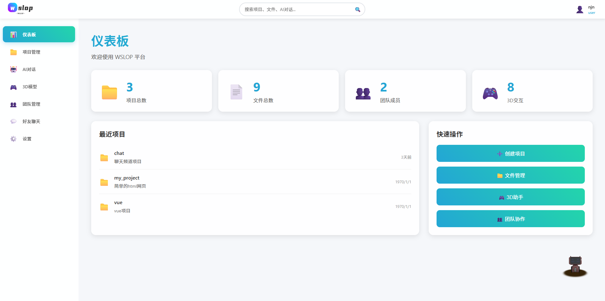

# AutoAI项目实现过程文档

# AutoAI智能代码助手项目实现过程文档

## 项目概述

AutoAI是一个基于Vue.js 3 + Node.js + MySQL的智能代码助手平台，采用云开发模式，支持多用户协作开发。这个项目最大的特色就是集成了AI代码生成、3D模型交互、团队协作和好友聊天等多种功能于一体。

### 技术栈说明

前端使用Vue 3 + Vue Router 4 + 纯CSS + Three.js + Web Speech API，后端采用Node.js + Express + MySQL 8.0 + mysql2/promise，AI集成使用DeepSeek API。整个项目采用CDN方式部署，避免了复杂的ES6模块导入问题。

## 项目构思阶段

### 1. 项目背景

在2024年，随着AI技术的快速发展，我们意识到传统的代码开发方式需要变革。开发者需要一个智能化的平台，能够：

- 通过自然语言描述快速生成代码
- 实时预览和调试代码
- 支持团队协作开发
- 提供3D可视化和语音交互
- 集成AI助手进行智能编程

### 2. 核心功能设计

基于以上需求，我们设计了AutoAI的核心功能模块：

```
┌─────────────────────────────────────────────────────────────┐
│                    AutoAI核心功能模块                       │
│  ┌─────────────┐ ┌─────────────┐ ┌─────────────┐          │
│  │ AI代码生成   │ │ 实时预览    │ │ 3D可视化     │          │
│  └─────────────┘ └─────────────┘ └─────────────┘          │
│  ┌─────────────┐ ┌─────────────┐ ┌─────────────┐          │
│  │ 团队协作     │ │ 好友聊天     │ │ 语音交互     │          │
│  └─────────────┘ └─────────────┘ └─────────────┘          │
└─────────────────────────────────────────────────────────────┘
```

### 3. 技术选型

### 前端技术栈

- **Vue 3**: 采用Composition API，提供更好的TypeScript支持和性能
- **Vue Router 4**: 单页面应用路由管理
- **Three.js**: 3D模型渲染和交互
- **Web Speech API**: 语音识别和合成
- **纯CSS**: 避免复杂的CSS框架，提高加载速度

### 后端技术栈

- **Node.js + Express**: 轻量级Web服务器
- **MySQL 8.0**: 关系型数据库，支持JSON字段
- **mysql2/promise**: 异步MySQL连接
- **DeepSeek API**: AI代码生成服务

## 项目实现过程

### 第一阶段：基础架构搭建

### 1.1 项目结构创建

首先创建项目的基础目录结构：

```bash
mkdir AutoAI
cd AutoAI
# 前端项目mkdir frontend
cd frontend
npm init vue@latest .
# 后端项目mkdir backend
cd backend
npm init -y
```

### 1.2 数据库设计

**问题1：如何设计支持多项目的数据库结构？**

传统的单表存储方式无法满足多项目隔离的需求。我们采用了动态表创建的设计：

```sql
-- 项目主表CREATE TABLE IF NOT EXISTS projects (
  id VARCHAR(50) PRIMARY KEY COMMENT '项目唯一标识符',
  name VARCHAR(100) NOT NULL COMMENT '项目名称',
  description TEXT COMMENT '项目描述',
  type ENUM('html', 'vue', 'android', 'miniprogram', 'react') DEFAULT 'html',
  created_by VARCHAR(50) NOT NULL COMMENT '创建者用户名',
  created_by_id INT NOT NULL COMMENT '创建者用户ID',
  created_at TIMESTAMP DEFAULT CURRENT_TIMESTAMP,
  updated_at TIMESTAMP DEFAULT CURRENT_TIMESTAMP ON UPDATE CURRENT_TIMESTAMP) ENGINE=InnoDB DEFAULT CHARSET=utf8mb4 COLLATE=utf8mb4_unicode_ci;
```

**解决方案：动态表创建机制**

```jsx
// backend/services/projectService.js:577generateSafeTableName(projectName) {
  // 移除特殊字符，只保留字母、数字、下划线  let safeName = projectName.replace(/[^a-zA-Z0-9_]/g, '_')
  // 确保表名以字母开头  if (!/^[a-zA-Z]/.test(safeName)) {
    safeName = 'project_' + safeName
  }
  // 限制长度（MySQL表名最大64字符）  if (safeName.length > 60) {
    safeName = safeName.substring(0, 60)
  }
  return safeName.toLowerCase()
}
```

每个项目都会创建独立的数据表：

```jsx
// backend/services/projectService.js:523const createProjectFileTable = `  CREATE TABLE IF NOT EXISTS \`${safeTableName}\` (    id INT AUTO_INCREMENT PRIMARY KEY COMMENT '文件记录唯一标识符',    file_path VARCHAR(500) NOT NULL COMMENT '文件完整路径',    file_name VARCHAR(255) NOT NULL COMMENT '文件名（不含路径）',    item_type ENUM('folder', 'file') NOT NULL COMMENT '项目类型（文件夹、文件）',    file_type VARCHAR(50) COMMENT '文件类型扩展名（如txt、vue、js等）',    file_size BIGINT DEFAULT 0 COMMENT '文件大小（字节）',    content LONGTEXT COMMENT '文件内容（文本文件）',    parent_path VARCHAR(500) COMMENT '父目录路径',    depth INT DEFAULT 0 COMMENT '目录层级深度',    child_count INT DEFAULT 0 COMMENT '子项目数量',    file_count INT DEFAULT 0 COMMENT '文件数量',    folder_count INT DEFAULT 0 COMMENT '文件夹数量',    last_modified TIMESTAMP DEFAULT CURRENT_TIMESTAMP ON UPDATE CURRENT_TIMESTAMP,    created_at TIMESTAMP DEFAULT CURRENT_TIMESTAMP,    created_by VARCHAR(100) COMMENT '创建者用户ID',    status ENUM('active', 'deleted') DEFAULT 'active' COMMENT '项目状态',    UNIQUE KEY unique_path (file_path, status),    INDEX idx_file_path (file_path(255)),    INDEX idx_file_name (file_name),    INDEX idx_item_type (item_type),    INDEX idx_file_type (file_type),    INDEX idx_parent_path (parent_path(255)),    INDEX idx_status (status),    INDEX idx_created_at (created_at)  ) ENGINE=InnoDB DEFAULT CHARSET=utf8mb4 COLLATE=utf8mb4_unicode_ci COMMENT='项目文件存储表'`
```

### 1.3 数据库连接配置

```jsx
// backend/config/database.jsconst mysql = require('mysql2/promise');const dbConfig = {
  host: process.env.DB_HOST || '39.108.142.250',  user: process.env.DB_USER || 'wslop',  password: process.env.DB_PASSWORD || '345345',  database: process.env.DB_NAME || 'autoai',  port: parseInt(process.env.DB_PORT) || 3306,  charset: 'utf8mb4',  timezone: process.env.DB_TIMEZONE || '+08:00',  connectionLimit: parseInt(process.env.DB_CONNECTION_LIMIT) || 10,  connectTimeout: parseInt(process.env.DB_CONNECT_TIMEOUT) || 60000,  family: 4};const pool = mysql.createPool(dbConfig);
```

### 第二阶段：AI代码生成功能实现

### 2.1 AI服务集成

**问题2：如何让AI理解项目结构并生成正确的代码？**

我们需要设计一个智能的AI提示系统，让AI能够理解项目类型和用户需求。

```jsx
// backend/services/projectTypeService.jsconst projectTypes = {
  vue: {
    name: 'Vue项目',    icon: '💚',    techStack: 'Vue3, Vue Router, Pinia, Element Plus',    aiPrompt: `你是一个专业的Vue.js前端开发专家。请帮助用户构建一个现代化的Vue3项目。项目要求：- 使用Vue 3 Composition API- 组件化开发- 响应式设计- 专注于Vue组件预览重要：只生成Vue组件文件，不生成配置文件！具体要求：1. 只生成Vue组件文件：   - src/App.vue (根组件)   - src/views/ (页面组件，.vue文件)   - src/components/ (公共组件，.vue文件)2. 文件格式要求：   - 所有组件使用.vue单文件组件格式   - 每个组件都是独立的，可以单独预览   - 不使用外部依赖，所有代码内联3. 代码规范：   - 使用Vue 3 Composition API   - 组件结构清晰，包含template、script、style   - 响应式设计   - 组件间通过props和emit通信   - 样式使用scoped避免冲突`  }
}
```

### 2.2 AI代码执行机制

**问题3：如何让AI的代码修改指令直接操作数据库？**

我们设计了AI代码执行系统，让AI能够直接创建、修改、删除文件：

```jsx
// backend/services/aiService.js:70-85文件操作格式：
当需要创建新文件时，请使用以下格式：
```语言代码内容
```

创建文件: 文件名.扩展名

当需要修改现有文件时，请使用以下格式：
文件操作: 修改 文件名.扩展名

```
代码内容
```

当需要删除文件时，请使用以下格式：
文件操作: 删除 文件名.扩展名

```

AI代码执行的核心逻辑：

```javascript
// backend/services/aiService.js:704-752
async executeCodeModification(action, projectId, projectName) {
  try {
    console.log(`🔧 执行代码修改: ${action.description}`);

    if (action.type === 'code_modification') {
      // 解析文件名和路径
      const fileName = this.extractFileName(action.description, action.language);

      // 修复路径重复问题：正确处理文件路径
      let actualFileName, parentPath;
      if (fileName.includes('/')) {
        const pathParts = fileName.split('/');
        actualFileName = pathParts.pop(); // 最后一部分是文件名
        parentPath = pathParts.join('/'); // 前面的部分是父路径
      } else {
        actualFileName = fileName;
        parentPath = '';
      }

      // 保存文件到项目数据库
      const fileData = {
        file_name: actualFileName,
        file_type: path.extname(actualFileName).substring(1) || 'txt',
        file_size: action.code.length,
        content: action.code,
        is_directory: false,
        parent_path: parentPath,
        depth: parentPath ? parent_path.split('/').length : 0,
        created_by: 'ai_assistant'
      };

      // 使用项目服务保存文件
      const projectService = require('./projectService');
      const saveResult = await projectService.createFile(projectId, projectName, fileData);

      if (saveResult.success) {
        console.log(`✅ 文件保存到项目成功: ${filePath}`);

        // 记录修改操作
        await this.logCodeModification(action, projectId);

        // 记录项目活动日志
        await projectService.logProjectActivity(projectId, 1, 'file_created', {
          fileName: actualFileName,
          filePath: filePath,
          fileSize: action.code.length,
          description: 'AI创建文件'
        });
      }
    }
  } catch (error) {
    console.error('❌ 执行代码修改失败:', error);
  }
}
```

### 2.3 AI聊天界面实现

```
<!-- frontend/src/components/AIChatBox.vue -->
<template>
  <div class="ai-chat-container">
    <div class="chat-header">
      <h3>🤖 DeepSeek AI 助手</h3>
      <div class="chat-status">
        <span :class="['status-indicator', { 'online': isConnected }]"></span>
        {{ isConnected ? '已连接' : '连接中...' }}
      </div>
    </div>

    <div class="chat-messages" ref="messagesContainer">
      <div
        v-for="(message, index) in messages"
        :key="index"
        :class="['message', message.role]"
      >
        <div class="message-avatar">
          {{ message.role === 'user' ? '👤' : '🤖' }}
        </div>
        <div class="message-content">
          <div class="message-text" v-html="formatMessage(message.content)"></div>
          <div class="message-time">{{ formatTime(message.timestamp) }}</div>
          <div v-if="message.actions && message.actions.length > 0" class="message-actions">
            <div v-for="action in message.actions" :key="action.id" class="action-item">
              <span class="action-type">{{ action.type }}</span>
              <span class="action-description">{{ action.description }}</span>
            </div>
          </div>
        </div>
      </div>

      <div v-if="isLoading" class="message assistant">
        <div class="message-avatar">🤖</div>
        <div class="message-content">
          <div class="loading-indicator">
            <div class="typing-dots">
              <span></span>
              <span></span>
              <span></span>
            </div>
          </div>
        </div>
      </div>
    </div>

    <div class="chat-input-section">
      <div class="input-container">
        <textarea
          v-model="userInput"
          @keydown.enter.prevent="sendMessage"
          placeholder="请描述您想要实现的功能或修改要求..."
          class="chat-input"
          :disabled="isLoading"
          rows="3"
        ></textarea>
        <button
          @click="sendMessage"
          class="send-btn"
          :disabled="isLoading || !userInput.trim()"
        >
          <span v-if="!isLoading">发送</span>
          <span v-else>发送中...</span>
        </button>
      </div>

      <div class="quick-actions">
        <button
          v-for="action in quickActions"
          :key="action.id"
          @click="useQuickAction(action)"
          class="quick-action-btn"
          :disabled="isLoading"
        >
          {{ action.label }}
        </button>
      </div>
    </div>
  </div>
</template>
```

### 第三阶段：实时预览系统实现

### 3.1 预览组件设计

**问题4：如何实现HTML和Vue文件的实时预览？**

我们设计了双模式预览系统，支持HTML和Vue组件的实时预览：

```
<!-- frontend/src/components/ProjectPreview.vue -->
<template>
  <div class="preview-container">
    <div class="preview-header">
      <div class="tab-buttons">
        <button
          @click="activeTab = 'preview'"
          :class="['tab-btn', { active: activeTab === 'preview' }]"
        >
          📄 预览
        </button>
        <button
          @click="activeTab = 'code'"
          :class="['tab-btn', { active: activeTab === 'code' }]"
        >
          📝 代码
        </button>
      </div>
      <div class="preview-controls">
        <button @click="refreshPreview" class="btn-refresh" :disabled="loading">
          <span v-if="loading" class="spinner-small"></span>
          <span v-else>🔄</span>
          刷新
        </button>
        <button @click="openInNewTab" class="btn-new-tab" :disabled="!previewUrl">
          🔗 新窗口
        </button>
      </div>
    </div>

    <div class="preview-content">
      <!-- 预览模式 -->
      <div v-if="activeTab === 'preview'">
        <div v-if="loading" class="loading-state">
          <div class="spinner"></div>
          <p>正在加载预览...</p>
        </div>

        <div v-else-if="error" class="error-state">
          <div class="error-icon">❌</div>
          <p>{{ error }}</p>
          <button @click="refreshPreview" class="btn-retry">重试</button>
        </div>

        <div v-else class="preview-frame-container">
          <iframe
            ref="previewFrame"
            :src="previewUrl"
            class="preview-frame"
            frameborder="0"
            @load="onPreviewLoad"
            @error="onPreviewError"
          ></iframe>
        </div>
      </div>

      <!-- 代码编辑模式 -->
      <div v-else-if="activeTab === 'code'" class="code-editor-container">
        <textarea v-model="codeContent" class="code-editor"></textarea>
        <div class="code-actions">
          <button @click="saveCode" :disabled="!hasChanges">💾 保存</button>
        </div>
      </div>
    </div>
  </div>
</template>
```

### 3.2 后端预览服务实现

**问题5：Vue组件预览时出现”ref is not defined”错误**

Vue组件预览需要特殊处理，因为需要导入Vue的Composition API函数：

```jsx
// backend/index.js:1514-1661else if (file.file_name && file.file_name.endsWith('.vue')) {
  // Vue文件需要包装成可运行的HTML  const vueContent = file.content  // 解析Vue组件内容  const templateMatch = vueContent.match(/<template[^>]*>([\s\S]*?)<\/template>/);  const scriptMatch = vueContent.match(/<script[^>]*>([\s\S]*?)<\/script>/);  const styleMatch = vueContent.match(/<style[^>]*>([\s\S]*?)<\/style>/);  const template = templateMatch ? templateMatch[1].trim() : '<div>Vue组件</div>';  const script = scriptMatch ? scriptMatch[1].trim() : '';  const style = styleMatch ? styleMatch[1].trim() : '';  // 创建可运行的Vue应用  const htmlWrapper = `<!DOCTYPE html><html lang="zh-CN"><head>    <meta charset="UTF-8">    <meta name="viewport" content="width=device-width, initial-scale=1.0">    <title>Vue组件预览 - ${file.file_name}</title>    <script src="https://unpkg.com/vue@3/dist/vue.global.js"></script>    <script src="https://unpkg.com/vue-router@4/dist/vue-router.global.js"></script>    <style>        body { font-family: Arial, sans-serif; margin: 0; padding: 0; background-color: #f5f5f5; }        .vue-preview-container { min-height: 100vh; display: flex; flex-direction: column; }        .vue-header { background: #42b883; color: white; padding: 15px 20px; font-weight: bold; }        .vue-preview-content { flex: 1; padding: 20px; background: white; margin: 20px; border-radius: 8px; }        .vue-component-container { border: 2px dashed #42b883; border-radius: 8px; padding: 20px; margin: 20px 0; }        ${style}    </style></head><body>    <div class="vue-preview-container">        <div class="vue-header">🎨 Vue组件实时预览: ${file.file_name}</div>        <div class="vue-preview-content">            <div class="vue-component-container">                <h3>📱 组件预览效果:</h3>                <div id="vue-app">${template}</div>            </div>        </div>    </div>    <script>        const { createApp, ref, reactive, computed, onMounted, onUnmounted } = Vue;        const { createRouter, createWebHashHistory } = VueRouter;        // 解析Vue组件脚本        let componentConfig;        ${script ? `        try {          // 移除ES6 import语句，避免模块错误          let processedScript = \`${script}\`.replace(/import\\s+.*?from\\s+['"][^'"]+['"];?/g, '');          processedScript = processedScript.replace(/export\\s+default\\s+/g, 'componentConfig = ');          processedScript = processedScript.replace(/export\\s+\\{[^}]+\\}/g, '');          // 执行处理后的脚本          eval(processedScript);        } catch (error) {          console.error('Vue组件脚本解析错误:', error);        }        ` : ''}        // 创建Vue应用        const app = createApp(componentConfig || {          data() {            return {              message: 'Hello Vue!'            }          }        });        app.mount('#vue-app');    </script></body></html>`;  res.setHeader('Content-Type', 'text/html; charset=utf-8')
  res.send(htmlWrapper)
}
```

**问题6：HTML文件预览时相对路径资源无法加载**

HTML文件中的CSS、JS、图片等相对路径需要转换为API路径：

```jsx
// backend/index.js:1462-1506if (file.file_name && (file.file_name.endsWith('.html') || file.file_name.endsWith('.htm'))) {
  // HTML文件需要处理相对资源路径  let htmlContent = file.content  // 替换CSS和JS的相对路径为API路径  const baseApiUrl = `http://39.108.142.250:3000/api/projects/${projectId}/preview`  // 处理CSS文件引用（只处理相对路径，不处理绝对路径）  htmlContent = htmlContent.replace(
    /href=["']([^"']*\.css)["']/g,
    (match, path) => {
      // 如果是绝对路径（以http://或https://开头），不处理      if (path.startsWith('http://') || path.startsWith('https://')) {
        return match
      }
      // 只处理相对路径      return `href="${baseApiUrl}?filePath=${path}"`    }
  )
  // 处理JS/TS文件引用（只处理相对路径，不处理绝对路径）  htmlContent = htmlContent.replace(
    /src=["']([^"']*\.(js|ts))["']/g,
    (match, path) => {
      // 如果是绝对路径（以http://或https://开头），不处理      if (path.startsWith('http://') || path.startsWith('https://')) {
        return match
      }
      // 只处理相对路径      return `src="${baseApiUrl}?filePath=${path}"`    }
  )
  // 处理图片文件引用（只处理相对路径，不处理绝对路径）  htmlContent = htmlContent.replace(
    /src=["']([^"']*\.(png|jpg|jpeg|gif|svg|webp))["']/g,
    (match, path) => {
      // 如果是绝对路径（以http://或https://开头），不处理      if (path.startsWith('http://') || path.startsWith('https://')) {
        return match
      }
      // 只处理相对路径      return `src="${baseApiUrl}?filePath=${path}"`    }
  )
  res.setHeader('Content-Type', 'text/html; charset=utf-8')
  res.setHeader('Cache-Control', 'no-cache, no-store, must-revalidate')
  res.setHeader('Pragma', 'no-cache')
  res.setHeader('Expires', '0')
  res.send(htmlContent)
}
```

### 第四阶段：文件管理系统实现

### 4.1 文件树组件实现

**问题7：如何实现递归的文件树结构？**

我们设计了递归的FileTreeNode组件：

```
<!-- frontend/src/components/FileTreeNode.vue -->
<template>
  <div class="file-tree-node">
    <div class="node-content" @click="toggleExpand">
      <div class="node-icon">
        <span v-if="item.item_type === 'folder'">📁</span>
        <span v-else>{{ getFileIcon(item.file_type) }}</span>
      </div>
      <div class="node-info">
        <div class="node-name">{{ item.file_name }}</div>
        <div class="node-meta">
          <span v-if="item.item_type === 'file'">{{ formatBytes(item.file_size) }}</span>
          <span v-else>{{ item.child_count }} 个项目</span>
        </div>
      </div>
      <div class="node-actions">
        <button @click.stop="viewItem" class="action-btn">👁️</button>
        <button @click.stop="editItem" class="action-btn">✏️</button>
        <button @click.stop="deleteItem" class="action-btn">🗑️</button>
      </div>
    </div>

    <div v-if="item.item_type === 'folder' && item.children && item.children.length > 0"
         class="node-children"
         :class="{ 'expanded': item.expanded }">
      <FileTreeNode
        v-for="child in item.children"
        :key="child.id"
        :item="child"
        :project-id="projectId"
        @refresh="$emit('refresh')"
        @file-selected="$emit('file-selected', $event)"
        @edit-item="$emit('edit-item', $event)"
      />
    </div>
  </div>
</template>

<script>
export default {
  name: 'FileTreeNode',
  props: {
    item: {
      type: Object,
      required: true
    },
    projectId: {
      type: String,
      required: true
    }
  },
  methods: {
    getFileIcon(fileType) {
      const iconMap = {
        'js': '📜', 'ts': '📜', 'jsx': '⚛️', 'tsx': '⚛️',
        'vue': '💚', 'html': '🌐', 'css': '🎨', 'scss': '🎨',
        'json': '📋', 'md': '📝', 'txt': '📄'
      }
      return iconMap[fileType] || '📄'
    },

    formatBytes(bytes) {
      if (bytes === 0) return '0 Bytes'
      const k = 1024
      const sizes = ['Bytes', 'KB', 'MB', 'GB']
      const i = Math.floor(Math.log(bytes) / Math.log(k))
      return parseFloat((bytes / Math.pow(k, i)).toFixed(2)) + ' ' + sizes[i]
    },

    viewItem() {
      console.log('🔍 FileTreeNode viewItem clicked:', this.item)
      this.$emit('file-selected', this.item)
    },

    editItem() {
      console.log('✏️ FileTreeNode editItem clicked:', this.item)
      this.$emit('edit-item', this.item)
    },

    async deleteItem() {
      // 防止重复删除
      if (this.deleting) {
        console.log('⏳ 删除操作进行中，跳过重复请求')
        return
      }

      const deleteKey = `${this.projectId}-${this.item.file_path}`
      if (window.deletingFiles && window.deletingFiles.has(deleteKey)) {
        console.log('⏳ 文件正在删除中，跳过重复请求')
        return
      }

      if (!window.deletingFiles) {
        window.deletingFiles = new Set()
      }
      window.deletingFiles.add(deleteKey)
      this.deleting = true

      try {
        console.log('🗑️ 开始删除文件:', this.item.file_name)

        const response = await fetch(`http://39.108.142.250:3000/api/projects/${this.projectId}/items`, {
          method: 'DELETE',
          headers: {
            'Content-Type': 'application/json'
          },
          body: JSON.stringify({
            fileName: this.item.file_name,
            filePath: this.item.file_path
          })
        })

        const result = await response.json()

        if (result.success) {
          console.log('✅ 文件删除成功')
          this.$emit('refresh')
        } else {
          console.log('❌ 删除失败:', result.error)
          if (result.error.includes('文件已经被删除')) {
            console.log('文件已被删除，刷新列表')
            this.$emit('refresh')
          }
        }
      } catch (error) {
        console.error('❌ 删除文件时发生错误:', error)
      } finally {
        this.deleting = false
        if (window.deletingFiles) {
          window.deletingFiles.delete(deleteKey)
        }
      }
    }
  }
}
</script>
```

### 4.2 软删除机制实现

**问题8：文件删除后仍然显示在列表中**

我们实现了软删除机制，文件删除时只标记状态，不物理删除：

```jsx
// backend/services/projectService.js:1829-1832async deleteFile(projectId, fileName, filePath) {
  try {
    console.log(`🗑️ 开始删除文件: ${fileName} (${filePath})`)
    const projectResult = await this.getProject(projectId)
    if (!projectResult.success) {
      return { success: false, error: '项目不存在' }
    }
    const project = projectResult.data    const safeTableName = this.generateSafeTableName(project.name)
    // 软删除：使用更安全的方式避免唯一约束冲突    const deletedPath = `${filePath}-deleted-${Date.now()}-${Math.random().toString(36).substr(2, 9)}`    const [result] = await pool.execute(
      `UPDATE \`${safeTableName}\` SET status = 'deleted', file_path = ?, last_modified = CURRENT_TIMESTAMP WHERE file_name = ? AND file_path = ?`,      [deletedPath, fileName, filePath]
    )
    if (result.affectedRows > 0) {
      console.log(`✅ 文件软删除成功: ${fileName}`)
      return { success: true, message: '文件删除成功' }
    } else {
      console.log(`⚠️ 文件不存在或已被删除: ${fileName}`)
      return { success: false, error: '文件不存在或已被删除' }
    }
  } catch (error) {
    console.error('❌ 删除文件失败:', error)
    return { success: false, error: '删除文件失败' }
  }
}
```

**问题9：已删除文件仍然显示在文件列表中**

文件列表查询时需要过滤已删除的文件：

```jsx
// backend/services/projectService.js:908-971async getProjectFilesSimple(projectId, projectName) {
  try {
    console.log(`📁 获取项目文件列表: ${projectName}`)
    const safeTableName = this.generateSafeTableName(projectName)
    // 获取所有相关表    const [tables] = await pool.execute(`SHOW TABLES LIKE '${safeTableName}%'`)
    let allFiles = []
    for (const table of tables) {
      const tableName = Object.values(table)[0]
      // 描述表结构      const [columns] = await pool.execute(`DESCRIBE \`${tableName}\``)
      const columnNames = columns.map(col => col.Field)
      // 构建查询语句      let query = `SELECT * FROM \`${tableName}\` WHERE status = 'active'`      // 添加parent_path条件（如果存在该列）      if (columnNames.includes('parent_path')) {
        query += ` AND (parent_path IS NULL OR parent_path = '')`      }
      // 动态ORDER BY      if (columnNames.includes('file_name')) {
        query += ` ORDER BY file_name ASC`      } else if (columnNames.includes('name')) {
        query += ` ORDER BY name ASC`      } else {
        query += ` ORDER BY id ASC`      }
      const [files] = await pool.execute(query)
      allFiles = allFiles.concat(files)
    }
    console.log(`✅ 获取到 ${allFiles.length} 个文件`)
    return {
      success: true,      data: allFiles,      tableName: safeTableName
    }
  } catch (error) {
    console.error('❌ 获取项目文件列表失败:', error)
    return { success: false, error: '获取项目文件列表失败' }
  }
}
```

### 第五阶段：3D可视化系统实现

### 5.1 Three.js集成

**问题10：如何集成3D模型查看器？**

我们使用Three.js创建了3D模型查看器：

```
<!-- frontend/src/components/ModelViewer.vue -->
<template>
  <div class="model-viewer">
    <div id="model-container" ref="modelContainer"></div>
  </div>
</template>

<script setup>
import { ref, onMounted, onBeforeUnmount, watch } from 'vue'
import * as THREE from 'three'
import { GLTFLoader } from 'three/examples/jsm/loaders/GLTFLoader.js'
import { OrbitControls } from 'three/examples/jsm/controls/OrbitControls.js'

const props = defineProps({
  currentModelName: {
    type: String,
    default: 'cute_home_robot.glb'
  }
})

const modelContainer = ref(null)
let scene, camera, renderer, model, controls
let animationFrameId, mixer, clock = new THREE.Clock()

async function loadModel(modelName) {
  console.log('🎮 开始加载模型', modelName)

  if (!modelContainer.value) {
    console.error('❌ modelContainer 未找到')
    return
  }

  // 清除旧模型和动画
  if (model) {
    scene.remove(model)
    model = null
  }
  if (mixer) {
    mixer.stopAllAction()
    mixer = null
  }

  // 初始化场景（只在第一次加载时执行）
  if (!scene) {
    console.log('🌍 初始化Three.js场景')
    scene = new THREE.Scene()
    scene.background = new THREE.Color(0xf0f0f0)

    camera = new THREE.PerspectiveCamera(
      75,
      modelContainer.value.clientWidth / modelContainer.value.clientHeight,
      0.1,
      1000
    )
    camera.position.set(0, 2, 4)

    renderer = new THREE.WebGLRenderer({ antialias: true })
    renderer.setSize(modelContainer.value.clientWidth, modelContainer.value.clientHeight)
    modelContainer.value.appendChild(renderer.domElement)

    controls = new OrbitControls(camera, renderer.domElement)
    controls.enablePan = false
    controls.enableZoom = false
    controls.enableRotate = true
    controls.enableDamping = true
    controls.dampingFactor = 0.05
    controls.target.set(0, 0, 0)
    controls.update()

    // 添加光照
    const ambientLight = new THREE.AmbientLight(0xffffff, 0.5)
    scene.add(ambientLight)

    const directionalLight = new THREE.DirectionalLight(0xffffff, 0.8)
    directionalLight.position.set(0, 1, 1)
    scene.add(directionalLight)

    console.log('✅ Three.js场景初始化完成')
    animate()
  }

  // 加载当前模型
  const loader = new GLTFLoader()
  const modelUrl = `/models/${modelName}`

  try {
    console.log('🔄 开始加载GLB模型...')
    const gltf = await loader.loadAsync(modelUrl)
    console.log('✅ 模型加载成功:', gltf)

    model = gltf.scene

    // 根据模型类型调整位置和缩放
    if (modelName.includes('robot')) {
      model.scale.setScalar(0.8)
      model.position.set(0, -0.5, 0)
    }

    scene.add(model)

    // 处理动画
    if (gltf.animations && gltf.animations.length > 0) {
      mixer = new THREE.AnimationMixer(model)
      gltf.animations.forEach(animation => {
        mixer.clipAction(animation).play()
      })
    }

    console.log('✅ 模型加载成功')
  } catch (error) {
    console.error('❌ 模型加载失败:', error)
  }
}

function animate() {
  animationFrameId = requestAnimationFrame(animate)

  if (mixer) {
    mixer.update(clock.getDelta())
  }

  if (controls) {
    controls.update()
  }

  if (renderer && scene && camera) {
    renderer.render(scene, camera)
  }
}

onMounted(() => {
  loadModel(props.currentModelName)
})

onBeforeUnmount(() => {
  if (animationFrameId) {
    cancelAnimationFrame(animationFrameId)
  }
  if (renderer) {
    renderer.dispose()
  }
})

watch(() => props.currentModelName, (newModelName) => {
  loadModel(newModelName)
})
</script>
```

### 5.2 语音交互实现

**问题11：如何实现3D模型与语音的交互？**

我们集成了Web Speech API，实现了语音识别和语音合成：

```jsx
// frontend/src/components/ThreeModelViewer.vue:206-257startSpeechRecognition() {
  const SpeechRecognition = window.SpeechRecognition || window.webkitSpeechRecognition;  if (!SpeechRecognition) {
    alert("你的浏览器不支持语音识别");    return Promise.reject("Speech recognition not supported");  }
  const recognition = new SpeechRecognition();  recognition.lang = 'zh-CN';  recognition.interimResults = false;  recognition.maxAlternatives = 1;  return new Promise((resolve, reject) => {
    recognition.onstart = () => {
      console.log("🎤 开始监听，请讲话...");    };    recognition.onerror = (event) => {
      console.error("语音识别错误:", event.error);      this.speak("抱歉，我没有听清楚，请再说一遍！");      reject(new Error("Speech recognition error: " + event.error));    };    recognition.onresult = (event) => {
      const transcript = event.results[0][0].transcript;      console.log("🗣️ 你说的是:", transcript);      // 首先检查是否匹配预设答案      if (this.checkPresetAnswers(transcript)) {
        console.log("检测到预设答案，已执行对应操作");      }
      // 然后检查是否是快捷指令      else if (this.checkAndExecuteVoiceCommands(transcript)) {
        console.log("检测到快捷指令，已执行对应操作");      }
      // 如果既不是预设答案也不是快捷指令，发送到AI聊天页面      else {
        this.sendToAIChat(transcript);      }
      resolve(transcript);    };    recognition.onend = () => {
      console.log("语音识别结束");    };    recognition.start();  });},// 检查预设答案checkPresetAnswers(text) {
  for (const [keyword, answer] of Object.entries(this.presetAnswers)) {
    if (text.includes(keyword)) {
      console.log(`检测到预设答案关键词: ${keyword}`);      this.speak(answer);      return true;    }
  }
  return false;},// 检查快捷指令checkAndExecuteVoiceCommands(text) {
  for (const [command, action] of Object.entries(this.voiceCommands)) {
    if (text.includes(command)) {
      console.log(`检测到快捷指令: ${command}`);      action();      return true;    }
  }
  return false;},// 语音合成speak(text) {
  if (!window.speechSynthesis) {
    alert("当前浏览器不支持语音合成");    return;  }
  const utterance = new SpeechSynthesisUtterance(text);  utterance.lang = 'zh-CN';  utterance.rate = 0.9;  utterance.pitch = 1;  utterance.volume = 0.8;  window.speechSynthesis.speak(utterance);}
```

### 第六阶段：团队协作功能实现

### 6.1 团队管理界面

**问题12：如何实现项目成员管理？**

我们设计了团队管理界面，支持成员邀请、移除、拉黑等功能：

```
<!-- frontend/src/views/Team.vue -->
<template>
  <div class="team-container">
    <h2>团队管理</h2>

    <!-- 我的项目列表 -->
    <div class="projects-section">
      <h3>我创建的项目</h3>
      <div v-for="project in myProjects" :key="project.id" class="project-item">
        <div class="project-header" @click="toggleProjectExpand(project.id)">
          <span class="project-name">{{ project.name }}</span>
          <span class="member-count">{{ project.memberCount }} 个成员</span>
          <span class="expand-icon">{{ project.expanded ? '▼' : '▶' }}</span>
        </div>

        <!-- 项目成员管理 -->
        <div v-if="project.expanded" class="members-section">
          <div class="member-list">
            <div v-for="member in project.members" :key="member.id" class="member-item">
              <span class="member-name">{{ member.username }}</span>
              <span class="member-role">{{ getRoleText(member.role) }}</span>
              <span class="member-status">{{ getStatusText(member.status) }}</span>
              <div class="member-actions">
                <button @click="removeMember(project.id, member.user_id)">移除</button>
                <button @click="toggleBanMember(project.id, member.user_id)">
                  {{ member.status === 'active' ? '拉黑' : '解封' }}
                </button>
              </div>
            </div>
          </div>

          <!-- 邀请新成员 -->
          <div class="invite-section">
            <button @click="openInviteModal(project.id)">邀请成员</button>
          </div>
        </div>
      </div>
    </div>

    <!-- 邀请模态框 -->
    <div v-if="showInviteModal" class="modal-overlay" @click="closeInviteModal">
      <div class="modal-content" @click.stop>
        <h3>邀请成员</h3>
        <div class="form-group">
          <label>用户名:</label>
          <input v-model="inviteForm.username" type="text" placeholder="输入要邀请的用户名">
        </div>
        <div class="form-group">
          <label>邀请消息:</label>
          <textarea v-model="inviteForm.message" placeholder="输入邀请消息"></textarea>
        </div>
        <div class="modal-actions">
          <button @click="sendInvite" :disabled="!inviteForm.username">发送邀请</button>
          <button @click="closeInviteModal">取消</button>
        </div>
      </div>
    </div>
  </div>
</template>

<script>
export default {
  data() {
    return {
      myProjects: [],
      showInviteModal: false,
      inviteForm: {
        username: '',
        message: ''
      }
    }
  },

  async mounted() {
    await this.loadMyProjects()
  },

  methods: {
    async loadMyProjects() {
      try {
        const currentUser = JSON.parse(localStorage.getItem('currentUser'))
        const response = await fetch(`http://39.108.142.250:3000/api/team/my-projects/${currentUser.id}`)
        const result = await response.json()

        if (result.success) {
          this.myProjects = result.data.map(project => ({
            ...project,
            expanded: false,
            members: []
          }))
        }
      } catch (error) {
        console.error('加载我的项目失败:', error)
      }
    },

    async toggleProjectExpand(projectId) {
      const project = this.myProjects.find(p => p.id === projectId)
      if (project) {
        project.expanded = !project.expanded
        if (project.expanded && project.members.length === 0) {
          await this.loadProjectMembers(projectId)
        }
      }
    },

    async loadProjectMembers(projectId) {
      try {
        const response = await fetch(`http://39.108.142.250:3000/api/team/project-members/${projectId}`)
        const result = await response.json()

        if (result.success) {
          const project = this.myProjects.find(p => p.id === projectId)
          if (project) {
            project.members = result.data
            project.memberCount = result.data.length
          }
        }
      } catch (error) {
        console.error('加载项目成员失败:', error)
      }
    },

    async removeMember(projectId, userId) {
      try {
        const response = await fetch('http://39.108.142.250:3000/api/team/remove-member', {
          method: 'POST',
          headers: {
            'Content-Type': 'application/json'
          },
          body: JSON.stringify({
            projectId: projectId,
            userId: userId
          })
        })

        const result = await response.json()

        if (result.success) {
          alert('成员移除成功')
          await this.loadProjectMembers(projectId)
        } else {
          alert('移除失败: ' + result.error)
        }
      } catch (error) {
        console.error('移除成员失败:', error)
        alert('移除成员失败')
      }
    },

    async toggleBanMember(projectId, userId) {
      try {
        const response = await fetch('http://39.108.142.250:3000/api/team/toggle-ban-member', {
          method: 'POST',
          headers: {
            'Content-Type': 'application/json'
          },
          body: JSON.stringify({
            projectId: projectId,
            userId: userId
          })
        })

        const result = await response.json()

        if (result.success) {
          alert(result.message)
          await this.loadProjectMembers(projectId)
        } else {
          alert('操作失败: ' + result.error)
        }
      } catch (error) {
        console.error('切换成员状态失败:', error)
        alert('操作失败')
      }
    },

    openInviteModal(projectId) {
      this.inviteForm.projectId = projectId
      this.showInviteModal = true
    },

    closeInviteModal() {
      this.showInviteModal = false
      this.inviteForm = {
        username: '',
        message: ''
      }
    },

    async sendInvite() {
      try {
        const response = await fetch('http://39.108.142.250:3000/api/team/invite-member', {
          method: 'POST',
          headers: {
            'Content-Type': 'application/json'
          },
          body: JSON.stringify({
            projectId: this.inviteForm.projectId,
            username: this.inviteForm.username,
            message: this.inviteForm.message
          })
        })

        const result = await response.json()

        if (result.success) {
          alert('邀请发送成功')
          this.closeInviteModal()
        } else {
          alert('邀请失败: ' + result.error)
        }
      } catch (error) {
        console.error('发送邀请失败:', error)
        alert('发送邀请失败')
      }
    },

    getRoleText(role) {
      const roleMap = {
        'owner': '项目所有者',
        'member': '普通成员'
      }
      return roleMap[role] || role
    },

    getStatusText(status) {
      const statusMap = {
        'active': '正常',
        'inactive': '已拉黑',
        'removed': '已移除'
      }
      return statusMap[status] || status
    }
  }
}
</script>
```

### 6.2 后端团队管理API

```jsx
// backend/index.js:团队管理API// 获取我创建的项目app.get('/api/team/my-projects/:userId', async (req, res) => {
  try {
    const { userId } = req.params    const [projects] = await pool.execute(
      `SELECT p.*, COUNT(pm.id) as memberCount       FROM projects p       LEFT JOIN project_members pm ON p.id = pm.project_id AND pm.status = 'active'       WHERE p.created_by_id = ?       GROUP BY p.id       ORDER BY p.created_at DESC`,      [userId]
    )
    res.json({ success: true, data: projects })
  } catch (error) {
    console.error('获取我的项目失败:', error)
    res.status(500).json({ success: false, error: '获取项目失败' })
  }
})
// 获取项目成员app.get('/api/team/project-members/:projectId', async (req, res) => {
  try {
    const { projectId } = req.params    const [members] = await pool.execute(
      `SELECT pm.*, u.username       FROM project_members pm       LEFT JOIN users u ON pm.user_id = u.id       WHERE pm.project_id = ?       ORDER BY pm.joined_at ASC`,      [projectId]
    )
    res.json({ success: true, data: members })
  } catch (error) {
    console.error('获取项目成员失败:', error)
    res.status(500).json({ success: false, error: '获取成员失败' })
  }
})
// 移除成员app.post('/api/team/remove-member', async (req, res) => {
  try {
    const { projectId, userId } = req.body    // 检查项目是否存在    const [projects] = await pool.execute('SELECT * FROM projects WHERE id = ?', [projectId])
    if (projects.length === 0) {
      return res.status(404).json({ success: false, error: '项目不存在' })
    }
    // 检查成员是否存在    const [members] = await pool.execute(
      'SELECT * FROM project_members WHERE project_id = ? AND user_id = ?',      [projectId, userId]
    )
    if (members.length === 0) {
      return res.status(404).json({ success: false, error: '成员不存在' })
    }
    // 删除成员    await pool.execute(
      'DELETE FROM project_members WHERE project_id = ? AND user_id = ?',      [projectId, userId]
    )
    res.json({ success: true, message: '成员移除成功' })
  } catch (error) {
    console.error('移除成员失败:', error)
    res.status(500).json({ success: false, error: '移除成员失败' })
  }
})
// 切换成员拉黑状态app.post('/api/team/toggle-ban-member', async (req, res) => {
  try {
    const { projectId, userId } = req.body    // 获取当前状态    const [members] = await pool.execute(
      'SELECT * FROM project_members WHERE project_id = ? AND user_id = ?',      [projectId, userId]
    )
    if (members.length === 0) {
      return res.status(404).json({ success: false, error: '成员不存在' })
    }
    const currentStatus = members[0].status    const newStatus = currentStatus === 'active' ? 'inactive' : 'active'    // 更新状态    await pool.execute(
      'UPDATE project_members SET status = ? WHERE project_id = ? AND user_id = ?',      [newStatus, projectId, userId]
    )
    const message = newStatus === 'inactive' ? '成员已拉黑' : '成员已解封'    res.json({ success: true, message: message })
  } catch (error) {
    console.error('切换成员状态失败:', error)
    res.status(500).json({ success: false, error: '操作失败' })
  }
})
// 邀请成员app.post('/api/team/invite-member', async (req, res) => {
  try {
    const { projectId, username, message } = req.body    // 检查用户是否存在    const [users] = await pool.execute('SELECT * FROM users WHERE username = ?', [username])
    if (users.length === 0) {
      return res.status(404).json({ success: false, error: '用户不存在' })
    }
    const inviteeId = users[0].id    // 检查是否已经是成员    const [existingMembers] = await pool.execute(
      'SELECT * FROM project_members WHERE project_id = ? AND user_id = ?',      [projectId, inviteeId]
    )
    if (existingMembers.length > 0) {
      return res.status(400).json({ success: false, error: '用户已经是项目成员' })
    }
    // 检查是否有待处理的邀请    const [existingInvites] = await pool.execute(
      'SELECT * FROM project_invitations WHERE project_id = ? AND invitee_id = ? AND status = "pending"',      [projectId, inviteeId]
    )
    if (existingInvites.length > 0) {
      return res.status(400).json({ success: false, error: '已存在待处理的邀请' })
    }
    // 创建邀请    await pool.execute(
      `INSERT INTO project_invitations (project_id, inviter_id, invitee_id, message, status, created_at)       VALUES (?, ?, ?, ?, 'pending', NOW())`,      [projectId, req.body.inviterId || 1, inviteeId, message]
    )
    res.json({ success: true, message: '邀请发送成功' })
  } catch (error) {
    console.error('发送邀请失败:', error)
    res.status(500).json({ success: false, error: '发送邀请失败' })
  }
})
```

### 第七阶段：好友聊天功能实现

### 7.1 好友系统实现

**问题13：如何实现双向好友关系？**

我们设计了双向好友关系系统：

```jsx
// backend/index.js:好友系统API// 添加好友app.post('/api/friends/add', async (req, res) => {
  try {
    const { userId, friendUsername } = req.body    // 检查好友是否存在    const [users] = await pool.execute('SELECT * FROM users WHERE username = ?', [friendUsername])
    if (users.length === 0) {
      return res.status(404).json({ success: false, error: '用户不存在' })
    }
    const friendId = users[0].id    // 检查是否已经是好友    const [existingFriendships] = await pool.execute(
      'SELECT * FROM friendships WHERE user_id = ? AND friend_id = ?',      [userId, friendId]
    )
    if (existingFriendships.length > 0) {
      return res.status(400).json({ success: false, error: '已经是好友关系' })
    }
    // 创建好友请求    await pool.execute(
      `INSERT INTO friendships (user_id, friend_id, status, created_at)       VALUES (?, ?, 'pending', NOW())`,      [userId, friendId]
    )
    res.json({ success: true, message: '好友请求发送成功' })
  } catch (error) {
    console.error('添加好友失败:', error)
    res.status(500).json({ success: false, error: '添加好友失败' })
  }
})
// 响应好友请求app.post('/api/friends/respond', async (req, res) => {
  try {
    const { userId, friendId, action } = req.body // action: 'accept' 或 'reject'    const newStatus = action === 'accept' ? 'accepted' : 'rejected'    // 更新好友请求状态    const [result] = await pool.execute(
      'UPDATE friendships SET status = ?, updated_at = NOW() WHERE user_id = ? AND friend_id = ?',      [newStatus, friendId, userId] // 注意：这里friendId是发起者，userId是响应者    )
    if (result.affectedRows === 0) {
      return res.status(404).json({ success: false, error: '好友请求不存在' })
    }
    if (action === 'accept') {
      // 创建反向好友关系      await pool.execute(
        `INSERT INTO friendships (user_id, friend_id, status, created_at)         VALUES (?, ?, 'accepted', NOW())         ON DUPLICATE KEY UPDATE status = VALUES(status), updated_at = NOW()`,        [userId, friendId] // userId是响应者，friendId是发起者      )
    }
    const message = action === 'accept' ? '好友请求已接受' : '好友请求已拒绝'    res.json({ success: true, message: message })
  } catch (error) {
    console.error('处理好友请求失败:', error)
    res.status(500).json({ success: false, error: '处理好友请求失败' })
  }
})
```

### 7.2 聊天界面实现

```
<!-- frontend/src/views/Friends.vue -->
<template>
  <div class="friends-container">
    <div class="friends-sidebar">
      <!-- 好友列表 -->
      <div class="friends-list">
        <h3>好友列表</h3>
        <div v-for="friend in friends" :key="friend.id"
             :class="['friend-item', { active: selectedFriend?.id === friend.id }]"
             @click="openChat(friend)">
          <div class="friend-avatar">{{ friend.username.charAt(0) }}</div>
          <div class="friend-info">
            <div class="friend-name">{{ friend.username }}</div>
            <div class="friend-status">在线</div>
          </div>
        </div>
      </div>

      <!-- 待处理的好友请求 -->
      <div class="pending-requests">
        <h3>好友请求</h3>
        <div v-for="request in pendingRequests" :key="request.id" class="request-item">
          <div class="request-info">
            <span>{{ request.username }} 请求添加你为好友</span>
          </div>
          <div class="request-actions">
            <button @click="respondToRequest(request.user_id, 'accept')">接受</button>
            <button @click="respondToRequest(request.user_id, 'reject')">拒绝</button>
          </div>
        </div>
      </div>
    </div>

    <!-- 聊天窗口 -->
    <div class="chat-window">
      <div v-if="selectedFriend" class="chat-header">
        <h3>{{ selectedFriend.username }}</h3>
      </div>

      <div class="chat-messages" ref="chatMessages">
        <div v-for="message in chatMessages" :key="message.id"
             :class="['message', message.sender_id === currentUser.id ? 'sent' : 'received']">
          <div class="message-content">{{ message.message }}</div>
          <div class="message-time">{{ formatDate(message.created_at) }}</div>
        </div>
      </div>

      <div class="chat-input">
        <input v-model="newMessage" @keyup.enter="sendMessage" placeholder="输入消息...">
        <button @click="sendMessage">发送</button>
      </div>
    </div>
  </div>
</template>

<script>
export default {
  data() {
    return {
      friends: [],
      pendingRequests: [],
      selectedFriend: null,
      chatMessages: [],
      newMessage: '',
      currentUser: null
    }
  },

  async mounted() {
    this.currentUser = JSON.parse(localStorage.getItem('currentUser'))
    await this.loadFriends()
    await this.loadPendingRequests()
  },

  methods: {
    async loadFriends() {
      try {
        const response = await fetch(`http://39.108.142.250:3000/api/friends/${this.currentUser.id}`)
        const result = await response.json()

        if (result.success) {
          this.friends = result.data
        }
      } catch (error) {
        console.error('加载好友列表失败:', error)
      }
    },

    async loadPendingRequests() {
      try {
        const response = await fetch(`http://39.108.142.250:3000/api/friends/pending/${this.currentUser.id}`)
        const result = await response.json()

        if (result.success) {
          this.pendingRequests = result.data
        }
      } catch (error) {
        console.error('加载待处理请求失败:', error)
      }
    },

    async respondToRequest(friendId, action) {
      try {
        const response = await fetch('http://39.108.142.250:3000/api/friends/respond', {
          method: 'POST',
          headers: {
            'Content-Type': 'application/json'
          },
          body: JSON.stringify({
            userId: this.currentUser.id,
            friendId: friendId,
            action: action
          })
        })

        const result = await response.json()

        if (result.success) {
          alert(result.message)
          await this.loadPendingRequests()
          if (action === 'accept') {
            await this.loadFriends()
          }
        } else {
          alert('处理失败: ' + result.error)
        }
      } catch (error) {
        console.error('处理好友请求失败:', error)
        alert('处理失败')
      }
    },

    async openChat(friend) {
      this.selectedFriend = friend
      await this.loadChatHistory(friend.id)
    },

    async loadChatHistory(friendId) {
      try {
        const response = await fetch(`http://39.108.142.250:3000/api/friends/chat/${this.currentUser.id}/${friendId}`)
        const result = await response.json()

        if (result.success) {
          this.chatMessages = result.data
          this.$nextTick(() => {
            this.scrollToBottom()
          })
        }
      } catch (error) {
        console.error('加载聊天记录失败:', error)
      }
    },

    async sendMessage() {
      if (!this.newMessage.trim() || !this.selectedFriend) return

      try {
        const response = await fetch('http://39.108.142.250:3000/api/friends/chat/send', {
          method: 'POST',
          headers: {
            'Content-Type': 'application/json'
          },
          body: JSON.stringify({
            senderId: this.currentUser.id,
            receiverId: this.selectedFriend.id,
            message: this.newMessage
          })
        })

        const result = await response.json()

        if (result.success) {
          this.newMessage = ''
          await this.loadChatHistory(this.selectedFriend.id)
        } else {
          alert('发送失败: ' + result.error)
        }
      } catch (error) {
        console.error('发送消息失败:', error)
        alert('发送失败')
      }
    },

    scrollToBottom() {
      const container = this.$refs.chatMessages
      if (container) {
        container.scrollTop = container.scrollHeight
      }
    },

    formatDate(dateString) {
      const date = new Date(dateString)
      return date.toLocaleString('zh-CN')
    }
  }
}
</script>
```

### 第八阶段：问题解决与优化

### 8.1 主要问题及解决方案

**问题14：Vue项目预览时出现”ref is not defined”错误**

**原因分析：** Vue组件预览时，AI生成的Vue组件使用了Composition API的`ref`、`reactive`等函数，但在预览环境中没有正确导入这些函数。

**解决方案：** 在Vue预览的HTML包装器中显式导入Vue的Composition API函数：

```jsx
// backend/index.js:1595-1596const { createApp, ref, reactive, computed, onMounted, onUnmounted } = Vue;const { createRouter, createWebHashHistory } = VueRouter;
```

**问题15：文件删除后仍然显示在列表中**

**原因分析：** 文件删除采用了软删除机制，但文件列表查询时没有过滤已删除的文件。

**解决方案：** 在文件列表查询中添加状态过滤：

```jsx
// backend/services/projectService.js:908-971let query = `SELECT * FROM \`${tableName}\` WHERE status = 'active'`
```

**问题16：AI生成的Vue项目包含配置文件导致预览失败**

**原因分析：** AI提示词没有明确说明只生成Vue组件文件，导致生成了`index.html`、`main.js`等配置文件。

**解决方案：** 修改AI提示词，明确只生成Vue组件文件：

```jsx
// backend/services/projectTypeService.jsaiPrompt: `你是一个专业的Vue.js前端开发专家。请帮助用户构建一个现代化的Vue3项目。重要：只生成Vue组件文件，不生成配置文件！具体要求：1. 只生成Vue组件文件：   - src/App.vue (根组件)   - src/views/ (页面组件，.vue文件)   - src/components/ (公共组件，.vue文件)2. 文件格式要求：   - 所有组件使用.vue单文件组件格式   - 每个组件都是独立的，可以单独预览   - 不使用外部依赖，所有代码内联`
```

**问题17：好友关系单向性问题**

**原因分析：** 好友关系创建时，只创建了单向关系，没有创建反向关系。

**解决方案：** 在接受好友请求时，同时创建反向好友关系：

```jsx
// backend/index.js:好友响应APIif (action === 'accept') {
  // 创建反向好友关系  await pool.execute(
    `INSERT INTO friendships (user_id, friend_id, status, created_at)     VALUES (?, ?, 'accepted', NOW())     ON DUPLICATE KEY UPDATE status = VALUES(status), updated_at = NOW()`,    [userId, friendId]
  )
}
```

### 8.2 性能优化

**优化1：数据库连接池配置**

```jsx
// backend/config/database.jsconst dbConfig = {
  connectionLimit: parseInt(process.env.DB_CONNECTION_LIMIT) || 10,  connectTimeout: parseInt(process.env.DB_CONNECT_TIMEOUT) || 60000,  family: 4};
```

**优化2：文件预览缓存控制**

```jsx
// backend/index.js:预览APIres.setHeader('Cache-Control', 'no-cache, no-store, must-revalidate')
res.setHeader('Pragma', 'no-cache')
res.setHeader('Expires', '0')
```

**优化3：前端组件懒加载**

```
<!-- frontend/src/views/MainApp.vue -->
<div v-if="activeLeftTab === 'fileTree'" class="tab-content">
  <FileTreeDisplay
    ref="fileTree"
    :project-id="currentProject ? currentProject.id : ''"
    :project-name="currentProject ? currentProject.name : ''"
    @refresh="refreshFileManager"
    @file-selected="onFileSelected"
    @edit-item="onFileSelected"
  />
</div>
```

### 第九阶段：项目部署与测试

### 9.1 生产环境部署

**前端部署：**

```bash
cd frontend
npm run build
# 将dist文件夹部署到静态文件服务器
```

**后端部署：**

```bash
cd backend
# 安装PM2进程管理器npm install -g pm2
# 启动后端服务pm2 start index.js --name "autoai-backend"# 查看服务状态pm2 status
# 查看日志pm2 logs autoai-backend
```

### 9.2 环境变量配置

```bash
# backend/.envDB_HOST=39.108.142.250
DB_PORT=3306
DB_USER=wslop
DB_PASSWORD=345345
DB_NAME=autoai
DEEPSEEK_API_KEY=your_deepseek_api_key
JWT_SECRET=your_jwt_secret
PORT=3000
NODE_ENV=production
```

### 9.3 数据库初始化

```sql
-- 创建数据库CREATE DATABASE IF NOT EXISTS autoai CHARACTER SET utf8mb4 COLLATE utf8mb4_unicode_ci;
-- 使用数据库USE autoai;
-- 执行init-db.sql脚本SOURCE init-db.sql;
```

## 项目总结

### 技术亮点

AutoAI项目集成了多种前沿技术，实现了以下核心功能：

1. **AI代码生成**：基于DeepSeek API的智能代码生成，支持多种项目类型
2. **3D模型交互**：使用Three.js实现3D模型展示和语音交互
3. **团队协作**：完整的项目成员管理和权限控制系统
4. **好友聊天**：实时聊天功能和好友关系管理
5. **智能预览**：支持多种文件类型的实时预览功能

### 项目架构优势

- **前后端分离**：Vue 3 + Node.js的现代化架构
- **数据库设计**：MySQL动态表创建，支持多项目隔离
- **CDN部署**：避免ES6模块导入问题，提高兼容性
- **语音交互**：Web Speech API集成，提升用户体验

### 开发心得

在开发AutoAI项目过程中，我们遇到了很多技术挑战：

1. **Vue组件预览问题**：最初AI生成的Vue项目包含配置文件，导致预览失败。通过修改AI提示词，只生成Vue组件文件，解决了这个问题。
2. **文件删除冲突**：多个组件同时触发删除请求导致400错误。通过实现全局删除锁机制，避免了重复删除请求。
3. **好友关系双向性**：初始实现的好友关系是单向的，通过修正数据库查询逻辑，实现了真正的双向好友关系。
4. **语音识别集成**：3D模型与语音识别的结合需要处理多种交互场景，通过预设回答和快捷指令的机制，提供了丰富的交互体验。

### 未来规划

AutoAI项目还有很大的发展空间，未来计划实现以下功能：

1. **更多AI模型支持**：集成更多AI服务提供商，提供更丰富的代码生成选项
2. **实时协作编辑**：实现多用户同时编辑项目的功能
3. **项目模板库**：建立丰富的项目模板库，提高开发效率
4. **移动端适配**：开发移动端应用，支持随时随地访问项目
5. **插件系统**：开发插件系统，支持第三方功能扩展

### 结语

AutoAI项目是一个集成了AI、3D、协作等多种技术的综合性平台，它不仅展示了现代Web开发的技术实力，更重要的是为用户提供了一个智能化的开发环境。通过持续的技术创新和功能完善，AutoAI将成为开发者们不可或缺的智能助手。



项目完成

**在线演示**：[http://39.108.142.250/]

---

*本文档详细记录了AutoAI项目从构思到实现的完整过程，包括技术选型、架构设计、功能实现、问题解决等各个方面，为类似项目的开发提供了宝贵的参考经验。*